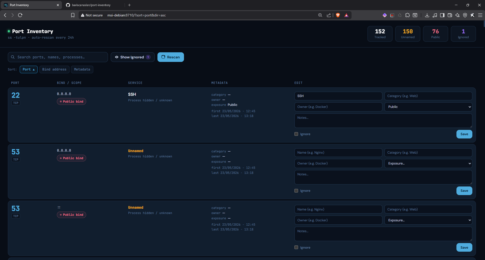
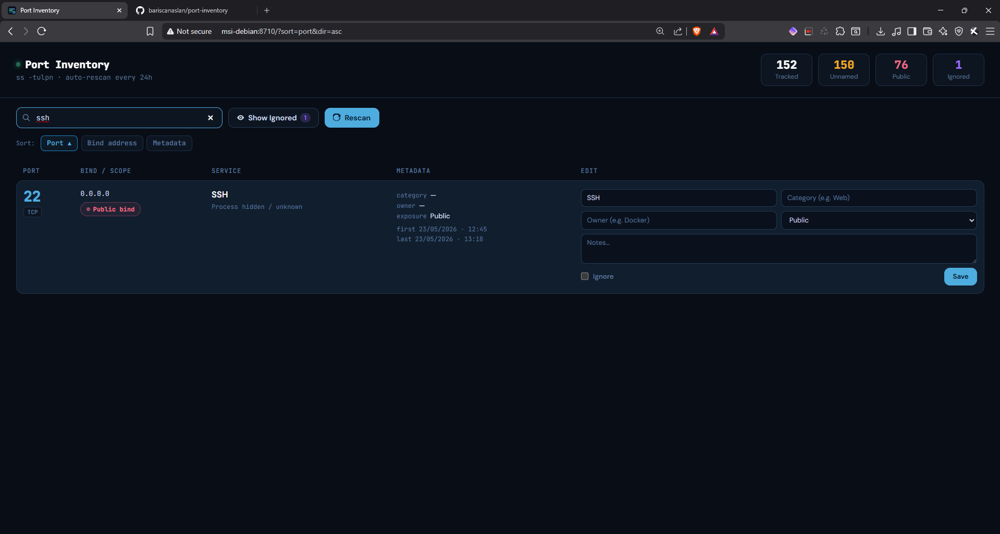
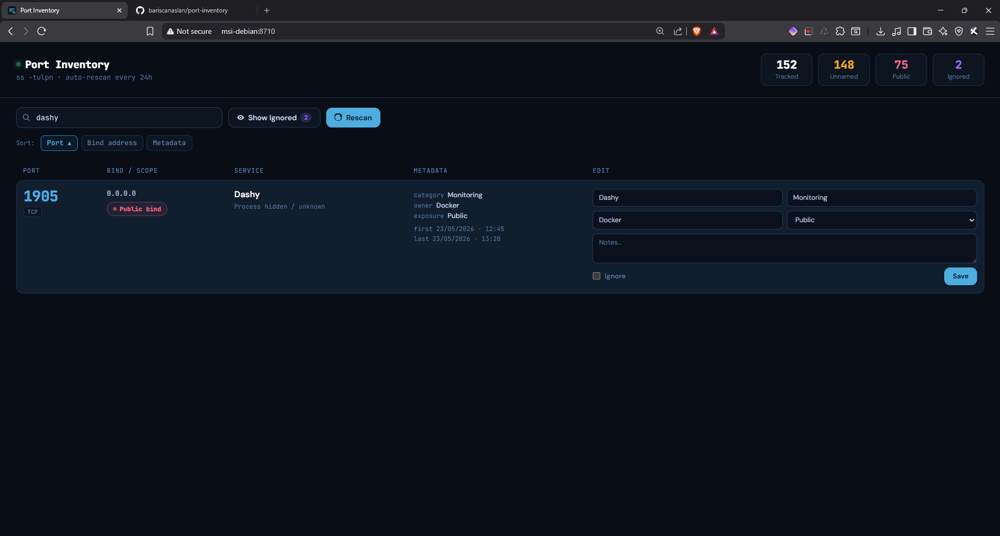

# 🔍 Port Inventory

A lightweight, self-hosted web UI for auditing listening ports on your Linux server.

Reads live data from `ss -tulpn`, persists metadata in SQLite, and lets you name, categorize, and annotate every port — so you always know what's running and why.


---

## Features

- **Live scan** — reads `ss -tulpn` on every page load and on a configurable auto-rescan schedule
- **Classify ports** — assign name, category, owner, exposure level, and notes to each port
- **Scope detection** — automatically labels ports as Public bind, Loopback, LAN/private, Tailscale/CGNAT, or Specific IP
- **Search** — instant client-side search across port number, name, process, category, notes
- **Sort** — sort by port number, bind address, or metadata
- **Ignored ports** — mark noisy/known ports as ignored; hidden by default, togglable
- **Timestamps** — tracks `first_seen` and `last_seen` for every port
- **Auto-rescan** — background thread rescans on a configurable interval (default: 24h)
- **Persistent storage** — SQLite database, survives restarts

---

## Screenshots





---

## Quick Start

### Option 1 — Docker Compose (recommended)

```bash
git clone https://github.com/bariscanaslan/port-inventory.git
cd port-inventory
docker compose up -d
```

Then open [http://localhost:8710](http://localhost:8710).

> **Note:** The container runs with `network_mode: host` and `pid: host` so it can read process names and all host ports via `ss -p`. `user: root` is required for process visibility.

---

### Option 2 — Bare metal / venv

**Requirements:** Python 3.10+, `iproute2` (`ss` command)

```bash
git clone https://github.com/bariscanaslan/port-inventory.git
cd port-inventory

python3 -m venv venv
./venv/bin/pip install flask

# Run as root to see process names/PIDs
sudo ./venv/bin/python app.py
```

---

## Configuration

All configuration is done via environment variables. No config files needed.

| Variable | Default | Description |
|---|---|---|
| `PORT_INVENTORY_DIR` | `/DATA/AppData/port-inventory` | Directory for app data |
| `PORT_INVENTORY_DB` | `<DIR>/port_inventory.sqlite3` | SQLite database path |
| `PORT_INVENTORY_HOST` | `127.0.0.1` | Host to bind the web UI to |
| `PORT_INVENTORY_PORT` | `8710` | Port to bind the web UI to |
| `PORT_INVENTORY_RESCAN_INTERVAL` | `86400` | Auto-rescan interval in seconds (default: 24h) |

### Bind address guidance

| `PORT_INVENTORY_HOST` | Use case |
|---|---|
| `127.0.0.1` | Loopback only — expose via Cloudflare Tunnel, Tailscale, or reverse proxy |
| `0.0.0.0` | All interfaces — direct LAN or Docker host access |

---

## Docker

### `docker-compose.yml`

```yaml
services:
  port-inventory:
    build:
      context: .
      dockerfile: Dockerfile

    container_name: port-inventory
    restart: unless-stopped

    network_mode: host
    pid: host

    user: root

    environment:
      PORT_INVENTORY_DIR: /data
      PORT_INVENTORY_DB: /data/port_inventory.sqlite3

      # Secure default: only reachable from within the host.
      # Pair with Cloudflare Tunnel, Tailscale, or a reverse proxy to expose externally.
      PORT_INVENTORY_HOST: 0.0.0.0

      PORT_INVENTORY_PORT: 8710

    volumes:
      - ./data:/data

    security_opt:
      - no-new-privileges:true
```

### `Dockerfile`

```dockerfile
FROM python:3.12-slim

ENV PYTHONDONTWRITEBYTECODE=1
ENV PYTHONUNBUFFERED=1

RUN apt-get update \
    && apt-get install -y --no-install-recommends \
        iproute2 \
        procps \
        ca-certificates \
    && rm -rf /var/lib/apt/lists/*

WORKDIR /app

RUN pip install --no-cache-dir flask gunicorn

COPY app.py /app/app.py

RUN mkdir -p /data

ENV PORT_INVENTORY_DIR=/data
ENV PORT_INVENTORY_DB=/data/port_inventory.sqlite3
ENV PORT_INVENTORY_HOST=0.0.0.0
ENV PORT_INVENTORY_PORT=8710

CMD ["python", "/app/app.py"]
```

---

## Systemd Service (bare metal)

```ini
# /etc/systemd/system/port-inventory.service
[Unit]
Description=Port Inventory
After=network.target

[Service]
Type=simple
WorkingDirectory=/opt/port-inventory
ExecStart=/opt/port-inventory/venv/bin/python app.py
Restart=on-failure
Environment=PORT_INVENTORY_HOST=127.0.0.1
Environment=PORT_INVENTORY_PORT=8710

[Install]
WantedBy=multi-user.target
```

```bash
sudo systemctl daemon-reload
sudo systemctl enable --now port-inventory
```

---

## Reverse Proxy (Nginx example)

```nginx
location /port-inventory/ {
    proxy_pass http://127.0.0.1:8710/;
    proxy_set_header Host $host;
    proxy_set_header X-Real-IP $remote_addr;
}
```

---

## Data

Port metadata is stored in a SQLite database at the configured `PORT_INVENTORY_DB` path. The `./data/` directory (Docker) or `PORT_INVENTORY_DIR` (bare metal) contains:

```
data/
└── port_inventory.sqlite3
```

The database is safe to back up while the app is running.

---

## License

MIT
